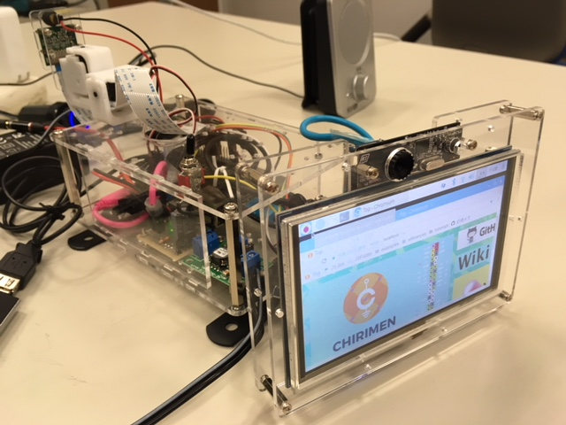

# DIY automotive Project

ある日、普段からCHIRIMENを触っているおっさんとか、あまり触ってなかったおっさんなどが集まり、レーザービーム付き車載システムを手作りすることになった。

というわけで、ここでは手作りしたハードについて書く。
機能とかシステム構成とかについては、[システム構成とかの資料]() を読んでください。

**1号機**    

## 前提

ハード構成は下記条件で検討した。

- 車載を想定したシステムであるが具体的な車種は規定しない。いまのところ。たぶんセダンタイプでも大丈夫な感じで作ろう。ということになった
- ダッシュボード上の空間に(取り外し可能な形で)設置。(ずっと置くと車検が通らないなど)。というわけで、全体で 奥行き30cm以内 x 幅15cm以内 x 高さ 10cm以内 程度の大きさの箱（ケース）に収める感じにする
- 本体はダッシュボード上に（仮止めとはいえ）固定するため、モニターはある程度角度調整が可能な構造とする
- タッチパネルで操作したい。モニタは5インチくらいの大きさが良いだろうということになった
- 電源はシガーソケット (DC 12V)から取る。ただし車載せずともデモができないとおもしろくないので、家庭用コンセント(AC 100V)とシガーソケット(DC 12V)を変換する電源ユニットもつくる
- GPSちゃんと取れるのか？怪しいが、一旦はフロントガラス経由でGPS測位できる想定で作る。(GPSモジュールを本体とは離して置けないと困るので本体からケーブルで伸ばせるようにする)
- スピーカーとマイクを近づけるとハウリングするのでスピーカーとマイクを離して設置できる構造が必要。マイクを離す手もあったけど、マイクはUSBカメラと一体になってるのを使いたかったので、スピーカーを外付けすることにした。

## パーツ一覧 

というわけで、冒頭の写真の「１号機」で使ったパーツは下記の通り。

### A. そのまま使うパーツ

1. [Raspberry Pi 3 Model B](https://www.raspberrypi.org/products/raspberry-pi-3-model-b/) x 1
2. [5インチ タッチパネルモニタ](https://www.amazon.co.jp/ELECROW-%E3%83%87%E3%82%A3%E3%82%B9%E3%83%97%E3%83%AC%E3%82%A4-800x480%E8%A7%A3%E5%83%8F%E5%BA%A6-%E3%82%BF%E3%83%83%E3%83%81%E3%82%B9%E3%82%AF%E3%83%AA%E3%83%BC%E3%83%B3-Raspberry/dp/B013JECYF2) x 1
3. [Raspberry Pi カメラモジュール v1.3 (車の前方撮影カメラ用)](http://akizukidenshi.com/catalog/g/gM-10476/)
4. [ポータブルスピーカ JVC SP-A35M-S](https://www.amazon.co.jp/gp/product/B002VITVE0/ref=oh_aui_detailpage_o02_s00?ie=UTF8&psc=1) x 1
5. [USB GPSモジュール GT-730F/L(SiRF)](http://akizukidenshi.com/catalog/g/gM-09272/) x 1
6. [Raspberry Pi カメラ用延長ケーブル (20cm〜)](https://www.amazon.co.jp/gp/product/B00KDZBCD6/ref=oh_aui_detailpage_o01_s00?ie=UTF8&psc=1) x 1
7. [HDMI延長アダプタ (L字 180度回転)](https://www.amazon.co.jp/gp/product/B0721MJGNN/ref=oh_aui_detailpage_o02_s00?ie=UTF8&psc=1) x 1
8. [スリムHDMIケーブル](https://www.amazon.co.jp/gp/product/B00KPP3MPA/ref=oh_aui_detailpage_o08_s00?ie=UTF8&psc=1) x 1 
9. [赤色ドットレーザー](http://akizukidenshi.com/catalog/g/gM-11821/)
10. [シガープラグ電源ケーブル](https://www.amazon.co.jp/gp/product/B01KRFE63Y/ref=oh_aui_detailpage_o01_s00?ie=UTF8&psc=1) x 1
11. [RCサーボ ブラケットセット](https://robot.tsukumo.co.jp/products/detail/644) x 2
12. [L字型 3.5mmステレオオーディオジャック延長ケーブル (10cmくらい)](https://www.aliexpress.com/item/DC3-5mm-Male-to-Female-Extension-stereo-Audio-Cable-15cm-90-Degree-Angled/32262817004.html?spm=a2g0s.9042311.0.0.ZXPDmG)
13. [USB延長ケーブル (Type A)]()
14. [12V 5A ACアダプタ](http://akizukidenshi.com/catalog/g/gM-06961/)
15. [シガーソケット電源ケーブル](https://www.amazon.co.jp/%E3%82%B7%E3%82%AC%E3%83%BC%E3%82%BD%E3%82%B1%E3%83%83%E3%83%88-%E3%83%A1%E3%82%B9-12V%E7%94%A8-%E9%9B%BB%E6%BA%90%E3%82%B1%E3%83%BC%E3%83%96%E3%83%AB%E4%BB%98-30cm/dp/B078WPZV7Q/ref=sr_1_31?s=automotive&ie=UTF8&qid=1521952190&sr=1-31&keywords=%E9%9B%BB%E6%BA%90+%E3%82%B7%E3%82%AC%E3%83%BC%E3%82%BD%E3%82%B1%E3%83%83%E3%83%88)

 (※ 12. 13. を併せた[この製品](
https://www.amazon.co.jp/auto-AC-DC%E5%A4%89%E6%8F%9B%E3%82%A2%E3%83%80%E3%83%97%E3%82%BF%E3%83%BC12V-%E9%9B%BB%E6%BA%90%E5%A4%89%E6%8F%9B%E3%82%A2%E3%83%80%E3%83%97%E3%82%BF%E3%83%BC-%E3%82%B7%E3%82%AC%E3%83%BC%E3%82%BD%E3%82%B1%E3%83%83%E3%83%88%E3%82%BF%E3%82%A4%E3%83%97-HLT-1200500C/dp/B07116WZHF/ref=sr_1_28?s=automotive&ie=UTF8&qid=1521952061&sr=1-28&keywords=%E9%9B%BB%E6%BA%90+%E3%82%B7%E3%82%AC%E3%83%BC%E3%82%BD%E3%82%B1%E3%83%83%E3%83%88)でも良さそうだけど試してない)

### B. 改造して使うパーツ

1. [USBカメラ (F2Fカメラ用) iBuffalo BSWHD06M](https://www.amazon.co.jp/gp/product/B00GZAF89W/ref=oh_aui_detailpage_o02_s01?ie=UTF8&psc=1) x 1
2. Micro B USB電源ケーブル
3. USB Type Aコネクタが付いた USB2.0ケーブル

### C. 電子部品

1. [DCDCコンバータ](http://akizukidenshi.com/catalog/g/gK-07728/) x 1
2. [トグルスイッチ]()
3. コンデンサ 1000uF(35V) x 1、220uF(16V) x 2
4. LED x 2
5. 抵抗 1kΩ x 1 2kΩ x 1
6. ユニバーサル基板 x 2
7. 電線(5Aくらい流しても大丈夫そうな太いやつや、普通のジャンパーケーブル適量)
8. [Molex 1.25mmピッチコンタクト](https://www.sengoku.co.jp/mod/sgk_cart/detail.php?code=EEHD-4B5Z) 使うの5本だけど圧着難しくてミスるので x 10
9. [Molex 1.25mmピッチコネクタのハウジング (5P)](https://www.marutsu.co.jp/pc/i/41986/) x 2 (使うの1つだけど予備入れて)
10. [ADT7410温度センサー](http://akizukidenshi.com/catalog/g/gM-06675/) x 1
11. [Raspi用長足ピンソケット (2列x20)](http://akizukidenshi.com/catalog/g/gC-10702/) x 1
12. 分割ピンヘッダ(2.54mmピッチ) 1x40 x 1
13. [PCA9685 IC単体](https://jp.rs-online.com/web/p/led-display-drivers/7275649/)
14. チップ抵抗 (0805) 220Ω x 2 、10kΩ x 1
15. チップコンデンサ (0805) 10uF x 1
16. ゴムブッシュ(3mm径くらいのやつ) x 2

### D. ケース用パーツ

1. [金具 19Ω314-3 黒](https://www.amazon.co.jp/%E3%83%8F%E3%82%A4%E3%83%AD%E3%82%B8%E3%83%83%E3%82%AF-19%E3%82%AA%E3%83%A1%E3%82%AC314-3-%E3%82%B8%E3%83%A7%E3%82%A4%E3%83%B3%E3%83%88-19%CE%A9314-3-%E9%BB%92/dp/B00C39XL7K) x 2
2. [金具 BS-558](https://store.shopping.yahoo.co.jp/cocoatta/4903757115583.html?sc_e=slga_pla)
3. [金具 6005](https://store.shopping.yahoo.co.jp/ayahadio/4905034060050.html?sc_e=slga_pla)
4. [金具 6001](https://store.shopping.yahoo.co.jp/hands-net/4905034060012.html?sc_i=shp_pc_search_itemlist_shsr_title)

5. [アクリル版 (リンクにおいてあるdxfファイルでレーザーカットを依頼する)](https://github.com/diy-automotive/case)

### E. その他 (T.B.D.)

下記概要だけ記載しておく。※あとで詳細化する予定。

1. ネジ、スペーサー、ナット、ワッシャー等 (M2,M2.6,M3,M4) 適量
2. ジャンパーケーブル 適量
3. 電線適量。電源とかの工作に使う

## 制作に必要な工具

- 電動ドリル
- ドライバー
- はんだごて、はんだ吸い取り線、はんだ
- フラックス、フラックスクリーナー
- ラジオペンチ
- ニッパー
- カッター
- 圧着工具 ([PA-09](https://www.yodobashi.com/product/100000001002004022/)/[PA-20](https://www.yodobashi.com/product/100000001002493185/?gad1=&gad2=g&gad3=&gad4=56278881131&gad5=4733500117604394886&gad6=1o1&gclid=CjwKCAjw7tfVBRB0EiwAiSYGM2PXHVkw076M0nHblvUYxSvrJmiqklgOjumo8atqDQbhuTxs9HHcMBoCniEQAvD_BwE&xfr=pla))
- ワイヤーストリッパー

## 制作手順 

(T.B.D.) 写真いれる予定。。。

### 1. [アクリル板データ](./case/)のレーザーカットと修正

レーザーカットサービスにカットを依頼しておく。
リードタイムがかかるので、最低2週間前にはやっておく。
今回は、[elecrow Acrylic Laser Cutting Service](https://www.elecrow.com/5pcs-acrylic-laser-cutting-service.html)へ依頼。OCS使って1週間で届いた。

レーザーカットデータは残念ながら現時点(v1/v2両方) では不完全なので、`bottom.dxf`の1枚だけ（上部に利用する側のみ）ドリルで穴をあけておく。
 (将来v3以降で修正されるはずなので、この工程はなくなる予定) ※割れないよう慎重に行うこと

穴をあける箇所は特に指定はないが、下記 2箇所 (穴としては5穴) の穴あけを行う。

- トグルスイッチ固定用の穴 (6mmくらいの穴をあける。いきなりこれを開けようとすると割れるので2mmくらいの穴を広げた方が良い)
- サーボモータ固定用の穴 (サーボモータ固定用の穴はすでに空いているが、後ろ側に寄りすぎていて干渉するため、同じような 4隅 9mm 間隔 2mmの穴を　よりケースの端側に開ける )

### 2. [HAT](./hat/)の基板を製造

基板製造業者に投げておく。回しものではないが [elecrow](https://www.elecrow.com/pcb-manufacturing.html) にアクリル板と一緒に投げると一緒に送ってくれる。

### 3. 電源ユニットの制作

電源ユニットは、下記で構成される。AC電源側から記載する

1. ACアダプタ (加工の必要なし)
2. シガーソケット (電線の端にDCジャックを付けておく) ※基板で加工が必要
3. シガープラグ (電線の端をDCDCコンバータの入力側に接続。ターミナル経由なのでネジ止めだけ)
4. DCDCコンバータ (秋月のキットなので、そのまま作ればOK)
5. 分岐基板 (DCDCの出力側のターミナルにつなぐケーブルの先を2列のピンヘッダで分岐させる用の基板。DCDCの出力側のVCCラインにトグルスイッチを付けておく)

上記分岐基板につなぐのは、Raspiの電源と、サーボモータの電源だが両方ケーブルの改造が必要となる。

#### 3.1 Raspi電源用ケーブルの改造

市販のmicro B端子の付いたUSB充電ケーブルを切断、USB micro Bコネクタ側を残して切断した側をQIコネクタ(メス)に加工する

#### サーボモータの電源

これはHATの項に記載。

### 4. HATの制作とRaspiとの固定

[HAT](./hat/)のデータは今回用に設計したものではないので、いろいろそのままは使わない。
PCA9685関連の部分のみ作る感じで PCA9685と周辺のチップコンデンサ(10uF)、チップ抵抗(220Ω x 2, 10kΩ x 1)、サーボ接続用のピンヘッダ、RaspiのGPIO接続用の長足ピンソケットだけハンダ付け。電源はUSB経由ではなく表面のRaspiの電源付近にあるコンデンサ(220uF)の部分にコンデンサと一緒にケーブル（太めを付けないと燃える。燃えた）を直接はんだ付けし、ケーブル反対側を電源ユニットのジャンパーに刺せるようQIコネクタ（メス）に加工しておく。ケーブルの長さは10cm程度で良い。

HATが制作できたら、Raspiに固定する。
まず、Raspiにある4箇所の固定用穴の底面にM2.6mmのスペーサー（片方がネジになってる。ネジ側をRaspiの穴に挿す）と、上面に、両方がナットになってるスペーサーで挟み込んで止める。これを4箇所ともやっておく。

次に、HATをRaspiに重ね、HATの上からM2.6のネジで、下のスペーサーとHATを挟み込むような形でネジ止めしておく。

### 5. P2P通話用カメラの改造

USBカメラを分解し、基板部分のみ利用する。
基板の1.25mmピッチコネクタと反対側がUSB Type Aになったケーブルを別途制作する。安いUSBケーブルを切って端子を圧着して作る。
1.25mmピッチコネクタの圧着が難しいので注意。圧着工具PA-09を使う。

### 6. 前景撮影用カメラユニットの作成

サーボで動くカメラユニットを作成する。

`camera-parts-v2.dxf`を出力したアクリル板を使いRaspiカメラと小型レーザーを組み合わせたユニットを作る。
M2のスペーサーとネジを使って固定するが、`camera-parts-v2.dxf`の後面側のパーツは穴の間隔が合わないので、下の穴はスペーサーで終端にする。
レーザーはゴムブッシュでアクリル板に固定する。

次に、サーボブラケットセットを組み立てる。カメラとレーザーを組み合わせたユニットを最後にネジ止めする

カメラのリボンケーブルは、一番下側になるサーボブラケットの中を通すようにしておくとあとあと取り回しがしやすい。

### 7. モニター部分の制作

モニターとP2P通話用カメラをアクリルケースに固定する。
`back.dxf`を出力したアクリル板と、`front.dxf`を出力したアクリル板を使う。

1. M2のネジ・スペーサを使ってカメラを`front.dxf`を出力したアクリル板へ固定する

2. `back.dxf`を出力したアクリル板へ、[金具 6001](https://store.shopping.yahoo.co.jp/hands-net/4905034060012.html?sc_i=shp_pc_search_itemlist_shsr_title) をネジ止めする。モニターとの隙間に干渉しないよう、6mmくらいのネジ推奨。

3. モニターの背面に4箇所 M2のネジが出ているので、そこにM2のスペーサー (5mm) を4箇所止める。
4. `back.dxf`を出力したアクリル板とスペーサーをM2ネジで固定する。
5. 最後にカメラを固定した`front.dxf`を出力したアクリル板と、`back.dxf`を出力したアクリル板を M2 13mmのスペーサー経由でネジ止めして固定する

### 8. 本体部分の制作(底面から)

`bottom.dxf` 2枚で本体ケース部分を作る。2枚のうち1枚は、1. の工程で穴あけ加工済み。こちらは上面に使うので、ここでは加工していないもう１枚を使う。

1. アクリル板に、足となる [金具 19Ω314-3](https://www.amazon.co.jp/%E3%83%8F%E3%82%A4%E3%83%AD%E3%82%B8%E3%83%83%E3%82%AF-19%E3%82%AA%E3%83%A1%E3%82%AC314-3-%E3%82%B8%E3%83%A7%E3%82%A4%E3%83%B3%E3%83%88-19%CE%A9314-3-%E9%BB%92/dp/B00C39XL7K) のうち、Raspiの電源側に近い部分の方を先にネジ止めしておく。M4ネジを使い、アクリル板との間にはゴムワッシャーを入れておく。(振動対策)Raspiを重ねた後でネジが入れられなくなるため。あとで手で絞められるように蝶ナットを使う。
2. アクリル板に、4. でHATをつなげたRaspiをネジ止めする。Raspi側の底面にスペーサーが付いているので、アクリル板の反対側からネジ止めするだけで固定できるが、Raspiの電源側の角のネジだけは止めないでおく。下の足と干渉するため。
3. 次に電源ユニットをネジ止めする。間にスペーサーを入れた方がやりやすそうだがお好みで。
4. 5cmの M3スペーサーを、アクリル板の4角に付けておく。このスペーサーで上面との固定を行う。
5. 反対側の足(金具 19Ω314-3)もつけておく。こちら側もゴムワッシャー経由でアクリル版とネジで固定するが、(金具 19Ω314-3)の下に[金具 BS-558](https://store.shopping.yahoo.co.jp/cocoatta/4903757115583.html?sc_e=slga_pla) を挟んでから止めておく。金具 BS-558は、のちにモニターとの接続に使う。

### 9. 本体部分の制作(上面)

`bottom.dxf` 1. の工程で穴あけ加工済みの方のアクリル版を使い上面パネルを作る。
このパネルには、電源ユニットのトグルスイッチと、 前景撮影用カメラユニット(サーボモータブラケット) を接続する

1. トグルスイッチは穴にトグルスイッチを通して、付属のワッシャーで固定する。
2. カメラユニットのサーボブラケットは、モーターの停止位置を調整したうえで、サーボホーンもネジ止めし（とても重要！モーターを壊す原因に！）アクリル版にM2ネジとナットで固定する

### 10. 配線と 本体部分の接続 (側面パネル、スペーサー経由で固定)

底面と上面を接続する前に、8. の底面パネル面で配線を行なっておく。

1. サーボモーターのコードは上パネルの丸い大きな穴経由でHATのピンヘッダに接続 (2つとも)
2. カメラはリボンケーブルを同様に上パネルの丸い大きな穴経由でRasoiのカメラコネクタに接続(HATが邪魔でやりにくいのでラジオペンチ等を使う)
3. マウス+キーボード用のUSBドングルをRaspiのUSBポートに挿しておく
4. 延長ケーブル経由でGPSレシーバもUSBポートに挿しておき、前景側の開口部から出しておく
5. L字オーディオジャックを挿して、これも前景側の開口部から出しておく
6. HDMIケーブルはケースの中に収まるよう丸めながらRaspiのHDMIコネクタに挿し、モニタ側の開口部に反対側を出しておく
7. 電源ユニットの電源ケーブルもモニタ側の開口部から出しておく
8. モニタの電源、タッチパネル用のジャンパーケーブルをRaspiのGPIOに挿し、反対(オス)側をモニタ側に出しておく

上記配線後、`front.dxf` (v2の場合は `camera-parts-v2.dxf` に含まれる) に含まれる側面用のパーツを底面パネルの穴に垂直に挿しこみ、最後に 9. で制作した上面パネルを底面に設置済みの5cmスペーサーとの間のネジ止めにより固定する。

### 11. 本体とモニター部分の固定

1. モニターに付属の「コ」の字型のHDMIコネクタと別途用意したL字型コネクタをモニター部分に接続し、そこに本体から出ているHDMIケーブルを接続する
2. 本体側から出ているジャンパーケーブルをモニタに接続する (VCC,GND,SPI)
3. P2P用カメラのUSBケーブルを接続する

上記接続が終わったら、最後に [金具 6005] を使い、モニタ側の[金具 6001]と、本体側の[金具 BS-558]をネジ止めしてモニタの「首」の部分を作って完成！

## 課題

いくつか既知の課題があるので、issueに登録することにする。

